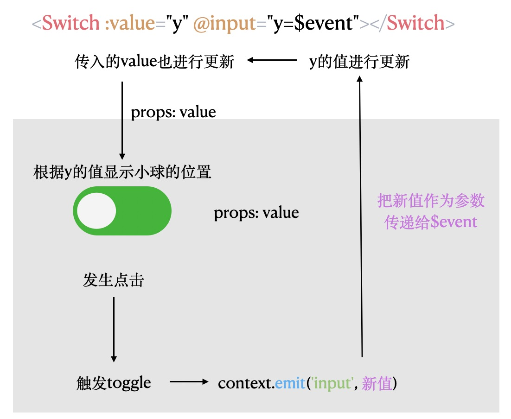

# Switch 组件

## 思路

当进行点击时里面的小球进行移动，并且盒子的背景色发生更改

## Switch 组件的基本结构

```html
<template>
  <button
    :class="{ checked: value, [`${size}`]: true }"
    @click="toggle"
    :style="colorStyle"
  >
    <span class="circle"></span>
    <span class="innerText" :class="{ checked: value }">
      <slot name="open" v-if="value"></slot>
      <slot name="close" v-else></slot>
    </span>
  </button>
</template>
```

```ts
 props: {
    value: Boolean,
    size: {
      type: String,
      default: 'normal',
    },
    openColor: String,
    closeColor: String,
  },
```

## 父子组件通信

```html
<!-- 负责监听input事件 当切换触发时 会接收到最新的value值 然后对 y进行更改 然后再次传入Switch组件 Switch 的状态发生改变-->
<Switch :value="y" @input="y=$event"></Switch>
```

```ts
  props:{
    value: Boolean
  },
  setup(props, context) {
    const toggle = () => {
      //当Switch的点击事件触发时 会触发input事件 会把第二个参数传递给外面的监听input 作为$event传入
      context.emit('input', !props.value)
    }
    return { toggle }
  }
```



### 父子通信进行简化

1.  ```html
    <Switch :value="y" @update:value="y=$event"></Switch>
    ```

    ```ts
    props:{
        value: Boolean
    },
    context.emit('update:value', !props.value)
    ```

2.  ```html
    <Switch v-model:value="y"></Switch>
    ```

    ```ts
    props:{
        value: Boolean
    },
    context.emit('update:value', !props.value)
    ```

3.  vue3 中的 v-model

    ```html
    属性名任意，假设为xxx 事件名必须为"update:xxx"
    <Switch :value="y" @update:value="y=$event"></Switch>
    可以简写为
    <Switch v-model:value="y"></Switch>
    ```

## Switch 支持文字切换及 slot 的使用

```html
<!-- 外面使用 -->
<!-- v-slot可以简写为# -->
<Switch v-model:value="show3">
  <template #open>
    <span>开</span>
  </template>
  <template #close>
    <span>关</span>
  </template>
</Switch>
```

```html
<!-- Switch组件内部 -->
<span class="innerText" :class="{ checked: value }">
  <slot name="open" v-if="value"></slot>
  <slot name="close" v-else></slot>
</span>
```

## Switch 支持自定义颜色

```html
<button
  :class="{ checked: value, [`${size}`]: true }"
  @click="toggle"
  :style="colorStyle"
></button>
```

```ts
 props: {
    value: Boolean,
    size: {
      type: String,
      default: 'normal',
    },
    openColor: String,
    closeColor: String,
  },
  setup(props, context) {
    // 方法的使用
    const toggle = () => {
      context.emit('update:value', !props.value)
    }
    // 计算属性的使用
    const colorStyle = computed(() => {
      let style = {}
      if (props.openColor && props.value === true) {
        style['background-color'] = props.openColor
      }
      if (props.closeColor && props.value === false) {
        style['background-color'] = props.closeColor
      }
      return style
    })
    return { toggle, colorStyle }
  },
```

## vue2 和 vue3 的区别

1. `v-model` 代替以前的 `v-model` 和 `.sync`
2. 新增 `context.emit` 与 `this.$emit` 作用相同
3. 新增了`setup()` 它是在`created()`之前 `beforeCreated()`之后执行的；返回的变量直接暴露给 template

```ts
setup() {
  // reactive state
  const count = ref(0)
  // computed state
  const plusOne = computed(() => count.value + 1)
  // method
  const increment = () => { count.value++ }
  // watch
  watch(() => count.value * 2, val => {
    console.log(`count * 2 is ${val}`)
  })
  // lifecycle
  onMounted(() => {
    console.log(`mounted`)
  })
  // expose bindings on render context
  return {
    count,
    plusOne,
    increment
  }
}
```
